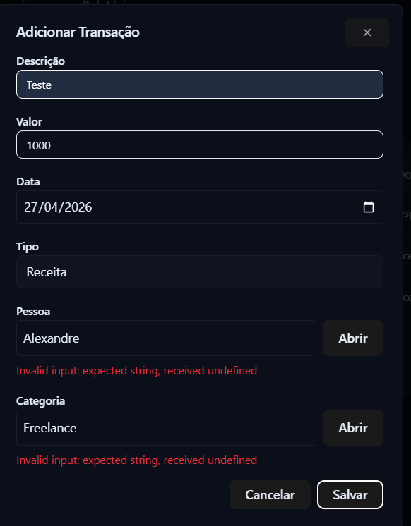
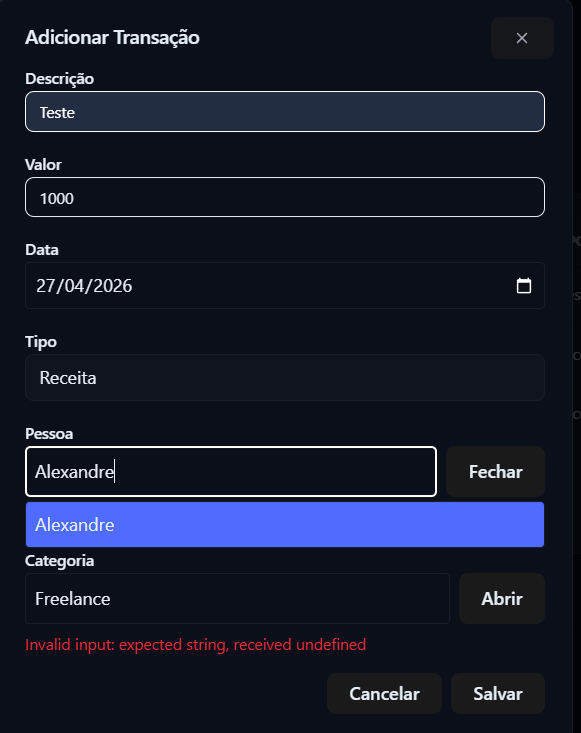
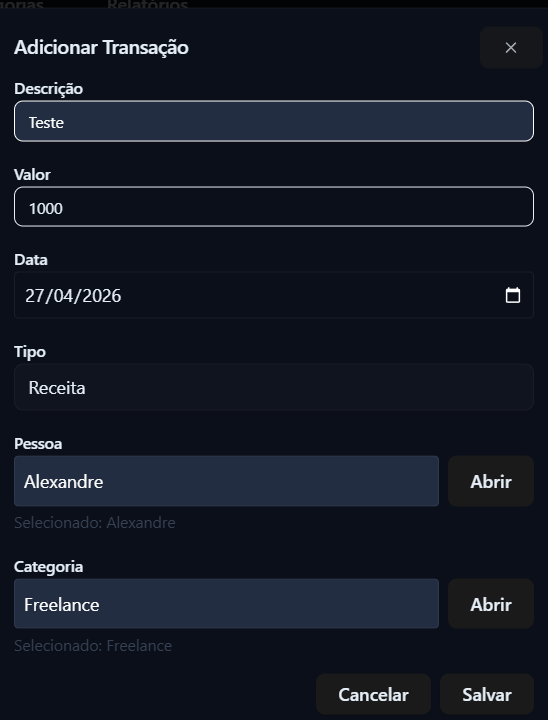
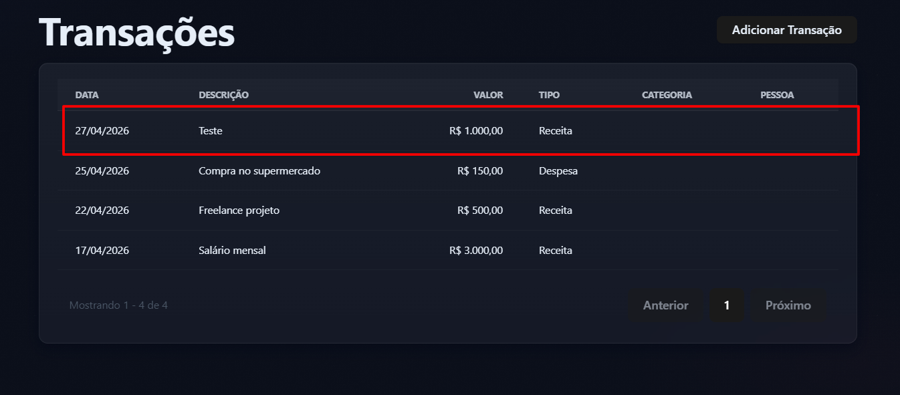

# FRONT-001 - Transição, combobox de Pessoa e Categoria exige seleção manual da opção após digitação

## Tipo
Bug de interface / Validação de formulário / Usabilidade

## Descrição
Ao cadastrar uma transação, os campos `Pessoa` e `Categoria` permitem que o usuário digite manualmente um valor existente no campo autocomplete. Porém, mesmo quando o texto digitado corresponde a uma opção válida, o sistema não reconhece o valor como selecionado.

Para que o cadastro funcione corretamente, é necessário abrir o combobox e clicar manualmente na opção desejada. Caso contrário, a aplicação exibe erro de validação.

## Comportamento esperado
Ao digitar um valor existente no campo autocomplete, o sistema deveria reconhecer automaticamente a opção correspondente ou orientar claramente o usuário a selecionar uma opção da lista.

Também seria esperado que a mensagem de erro fosse amigável, indicando algo como:

```text
Selecione uma pessoa válida.
Selecione uma categoria válida.
```

## Comportamento obtido

Quando o usuário apenas digita o nome da pessoa ou categoria e tenta salvar a transação, o sistema exibe erro técnico: `Invalid input: expected string, received undefined`

Mesmo visualmente parecendo que o campo foi preenchido corretamente, a transação não é salva.

## Passos para reproduzir

- Acessar a aplicação pelo frontend.
- Navegar até a tela Transações.
- Clicar no botão Adicionar Transação.
- Preencher o campo Descrição.
- Preencher o campo Valor.
- Preencher o campo Data.
- Selecionar o tipo da transação, por exemplo Receita.
- No campo Pessoa, digitar manualmente o nome de uma pessoa existente.
- Não clicar na opção exibida na lista do combobox.
- No campo Categoria, digitar manualmente o nome de uma categoria existente.
- Não clicar na opção exibida na lista do combobox.
- Clicar em Salvar.
- Observar que a aplicação exibe erro de validação técnico.
- Repetir o fluxo clicando manualmente na opção exibida no combobox.
- Observar que, após selecionar a opção manualmente, o campo passa a ser aceito corretamente.

## Impacto
O comportamento pode confundir o usuário, pois o campo aparenta estar preenchido corretamente, mas internamente o valor não foi reconhecido pela aplicação.
Além disso, a mensagem exibida é técnica e pouco amigável, o que prejudica a experiência de uso e dificulta a compreensão do problema.
## Severidade

Média

## Explicação

A falha pode impedir o cadastro de uma transação caso o usuário apenas digite o valor e não selecione a opção manualmente. Não causa perda direta de dados, mas afeta a usabilidade e bloqueia um fluxo importante da aplicação.

## Evidências







