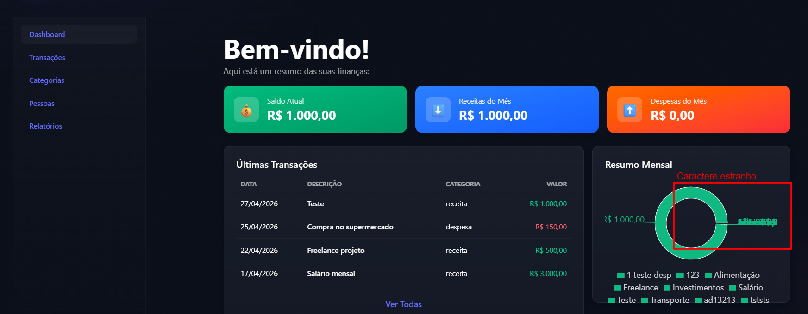

# FRONT-002 - Caractere estranho exibido no gráfico de resumo mensal

## Tipo
Bug visual / Interface / Legibilidade

## Descrição
Durante a análise manual da interface, foi identificado um caractere estranho sendo exibido sobre o gráfico de `Resumo Mensal` na tela inicial/dashboard.

O caractere aparece próximo à área central/lateral do gráfico, interferindo na leitura visual do componente.

## Comportamento esperado
O gráfico de resumo mensal deveria exibir apenas as informações relacionadas às categorias e valores financeiros, sem caracteres, símbolos ou textos quebrados sobrepostos ao componente.

## Comportamento obtido
A tela exibe um caractere estranho sobre o gráfico de resumo mensal, próximo à área de visualização dos dados.

Esse comportamento prejudica a legibilidade do gráfico e passa a impressão de falha visual ou renderização incorreta do componente.

## Passos para reproduzir

- Acessar a aplicação pelo frontend.
- Navegar até a tela inicial/dashboard.
- Observar o componente `Resumo Mensal`.
- Verificar o gráfico exibido na lateral direita da tela.
- Observar que há um caractere estranho/símbolo indevido sendo exibido sobre o gráfico.

## Impacto
O problema afeta a experiência visual do usuário e prejudica a leitura do gráfico de resumo mensal.

Embora não impeça diretamente o uso da aplicação, reduz a percepção de qualidade da interface e pode causar confusão na interpretação dos dados.

## Severidade
Baixa

## Justificativa da severidade
A falha é visual e não bloqueia o fluxo principal da aplicação. No entanto, impacta a legibilidade, a apresentação dos dados e a qualidade percebida da interface.

## Evidência

