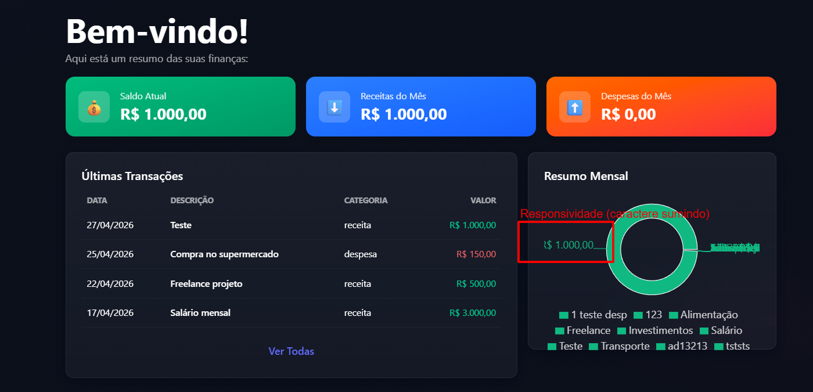

# FRONT-003 - Gráfico de resumo mensal perde legibilidade em resolução reduzida

## Tipo
Bug visual / Responsividade / Interface

## Descrição
Durante a análise manual da interface, foi identificado que o componente `Resumo Mensal` apresenta problema de responsividade em resoluções reduzidas.

Ao diminuir a largura da tela, parte das informações exibidas ao lado do gráfico fica cortada ou sobreposta, prejudicando a leitura dos dados.

## Comportamento esperado
O gráfico de resumo mensal deveria se adaptar corretamente ao tamanho da tela, mantendo os valores, legendas e textos visíveis e legíveis.

Em resoluções menores, o componente poderia reorganizar os elementos, reduzir proporcionalmente o gráfico ou quebrar o conteúdo em linhas para evitar corte ou sobreposição.

## Comportamento obtido
Em resolução reduzida, textos e valores próximos ao gráfico ficam parcialmente ocultos, cortados ou sobrepostos.

O problema afeta a leitura do valor exibido e prejudica a interpretação do componente de resumo mensal.

## Passos para reproduzir

1. Acessar a aplicação pelo frontend.
2. Navegar até a tela inicial/dashboard.
3. Reduzir a largura da janela do navegador ou utilizar o modo responsivo do DevTools.
4. Observar o componente `Resumo Mensal`.
5. Verificar que parte dos textos/valores do gráfico fica cortada ou perde legibilidade.

## Impacto
O problema prejudica a experiência do usuário em telas menores e compromete a leitura das informações financeiras exibidas no gráfico.

Embora não bloqueie o uso da aplicação, afeta a usabilidade, a responsividade e a qualidade visual da interface.

## Severidade
Média

## Justificativa da severidade
A falha não impede a navegação principal, mas compromete a leitura de dados importantes do dashboard em resoluções menores. Como o dashboard é uma tela de resumo financeiro, a perda de legibilidade pode impactar a compreensão das informações pelo usuário.

## Evidência

