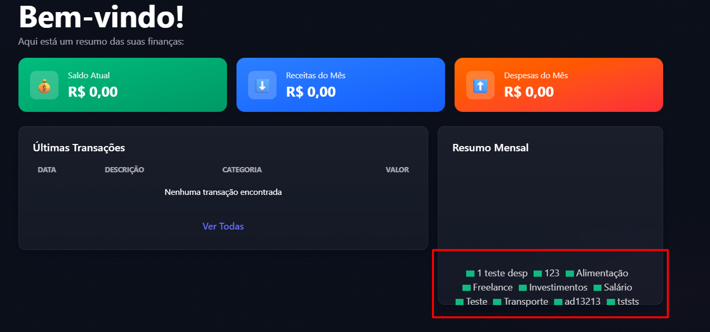

# FRONT-005 - Dashboard exibe categorias no resumo mensal mesmo sem transações

## Tipo
Bug visual / Consistência de dados / Interface

## Descrição
Durante a análise manual da interface, foi identificado que o dashboard continua exibindo categorias no componente `Resumo Mensal` mesmo após a exclusão das pessoas e das transações vinculadas.

A tela informa que não há transações encontradas, e os cards principais exibem valores zerados. Porém, o resumo mensal ainda apresenta legendas de categorias cadastradas no banco.

## Comportamento esperado
Quando não houver transações cadastradas, o componente `Resumo Mensal` deveria exibir estado vazio ou mensagem informativa, como:

```text
Nenhuma transação encontrada.
```

Também seria esperado que categorias sem transações não fossem exibidas como parte do resumo mensal.

## Comportamento obtido
Após excluir pessoas e suas transações vinculadas, o dashboard apresenta:
Saldo Atual: `R$ 0,00`;
Receitas do Mês: `R$ 0,00`;
Despesas do Mês: `R$ 0,00`;
tabela de últimas transações sem registros;
legendas de categorias ainda exibidas no componente Resumo Mensal.
## Passos para reproduzir
Acessar a aplicação pelo frontend.
Criar uma pessoa.
Criar categorias.
Criar transações vinculadas à pessoa.
Excluir a pessoa criada.
Retornar ao dashboard.
Observar que os valores financeiros estão zerados e não há transações listadas.
Observar que o componente Resumo Mensal ainda exibe categorias/legendas.
## Impacto
O comportamento pode confundir o usuário, pois a tela indica ausência de transações, mas ainda exibe categorias no resumo mensal.
Isso reduz a clareza do dashboard e pode transmitir a impressão de que ainda existem dados financeiros ativos associados às categorias.
## Severidade
Baixa
## Justificativa da severidade
A falha não bloqueia o uso da aplicação e não altera os valores financeiros exibidos, que permanecem zerados. Porém, afeta a consistência visual e a interpretação das informações no dashboard.
## Evidências

