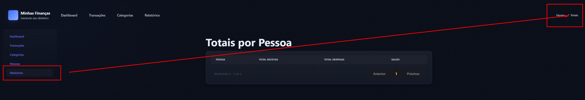

# FRONT-006 - Inconsistência entre menu "Relatórios" e breadcrumb "Totais"

## Tipo
Bug visual / Consistência de interface / Navegação

## Descrição
Durante a análise manual da interface, foi identificada uma inconsistência de nomenclatura na tela de relatórios.

No menu lateral, o item de navegação é exibido como `Relatórios`. Porém, ao acessar a tela, o breadcrumb no canto superior direito exibe `Home / Totais`.

Essa diferença pode gerar dúvida sobre se o usuário está acessando a tela de relatórios ou uma tela chamada totais.

## Comportamento esperado
A nomenclatura da tela deveria ser padronizada entre menu, rota visual, breadcrumb e título da página.

Exemplo esperado:

```text
Menu: Relatórios
Breadcrumb: Home / Relatórios
Título: Totais por Pessoa
```

## Comportamento obtido

A interface apresenta nomenclaturas diferentes para a mesma área:
Menu lateral: `Relatórios`;
Breadcrumb: `Home / Totais`;
Título da página: `Totais por Pessoa`.
## Passo para reproduzir

Acessar a aplicação pelo frontend.
Clicar no item Relatórios no menu lateral.
Observar o breadcrumb no canto superior direito da tela.
Verificar que o breadcrumb exibe Home / Totais, enquanto o menu lateral utiliza Relatórios.

## Impacto

A inconsistência não bloqueia o uso da aplicação, mas reduz a clareza da navegação e pode gerar confusão para o usuário sobre a seção acessada.
Também afeta a padronização visual e textual da interface.
## Severidade

Baixa

## Justificativa da severidade

A falha é de consistência visual e nomenclatura. Não impede a navegação nem compromete diretamente os dados, mas afeta a experiência e a percepção de qualidade da aplicação.

## Evidências

